# prototype
* JS通过构造函数生成新对象，因此构造函数可以视为对象的模板。实例对象的属性和方法，可以定义在构造函数内部。
```
function Cat (name, color) {
  this.name = name;
  this.color = color;
}

var cat1 = new Cat('大毛', '白色');

cat1.name // '大毛'
cat1.color // '白色'

```
> 上面代码中，Cat函数是一个构造函数，函数内部定义了name属性和color属性，所有实例对象（上例是cat1）都会生成这两个属性，即这两个属性会定义在实例对象上面。
* 通过构造函数为实例对象定义属性，虽然很方便，但是有一个缺点。同一个构造函数的多个实例之间，无法共享属性，从而造成对系统资源的浪费。
>Javascript 规定，每一个构造函数都有一个 prototype 属性，指向另一个对象。这个对象的所有属性和方法，都会被构造函数的实例继承。这也就意味着，我们可以把所有对象实例需要共享的属性和方法直接定义在 prototype 对象上。可以节省空间。
```
function Cat (name, color) {
  this.name = name;
  this.color = color;
}

Cat.prototype.color='white';

var cat1 = new Animal('大毛');
var cat2 = new Animal('二毛');

cat1.color // 'white'
cat2.color // 'white'
```
> 上述代码实现了属性共享，这时所有实例的 color 属性，其实都是同一个内存地址，指向 prototype 对象，因此就提高了运行效率。
*任何函数都具有一个 prototype 属性，该属性是一个对象*
```
function F () {}
console.log(F.prototype) // => object

```
* 构造函数的 prototype 对象默认都有一个 constructor 属性，指向 prototype 对象所在函数。
```
 F.constructor === F)  // => true
```
# __proto__
> 通过构造函数得到的实例对象内部会包含一个指向构造函数的 prototype 对象的指针 __proto__。
```
var ff = new F()
console.log(ff.__proto__ === F.prototype) // => true

```
* 实例对象可以直接访问原型对象成员。

>>总结: - 任何函数都具有一个 prototype 属性，该属性是一个对象
>>     - 构造函数的 prototype 对象默认都有一个 constructor 属性，指向 prototype 对象所在函数
>>     - 通过构造函数得到的实例对象内部会包含一个指向构造函数的 prototype 对象的指针 __proto__
>>     - 所有实例都直接或间接继承了原型对象的成员
# 原型链
>> JavaScript 规定，所有对象都有自己的原型对象（prototype）。一方面，任何一个对象，都可以充当其他对象的原型；另一方面，由于原型对象也是对象，所以它也有自己的原型。因此，就会形成一个“原型链”（prototype chain）：
- 先在自己身上找，找到即返回
- 自己身上找不到，则沿着原型链向上查找，找到即返回
- 如果一直到原型链的末端还没有找到，则返回 undefined

* 修改原型对象时，一般要同时修改constructor属性的指向。

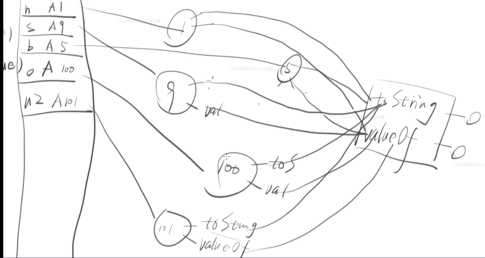
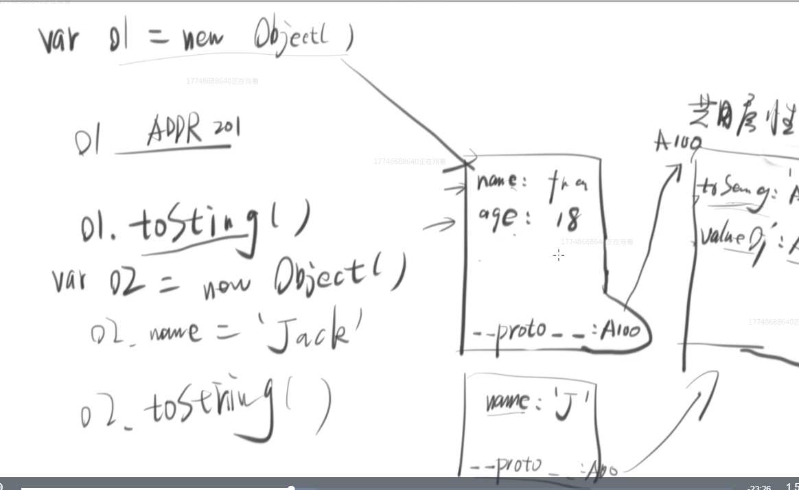
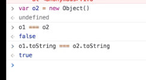
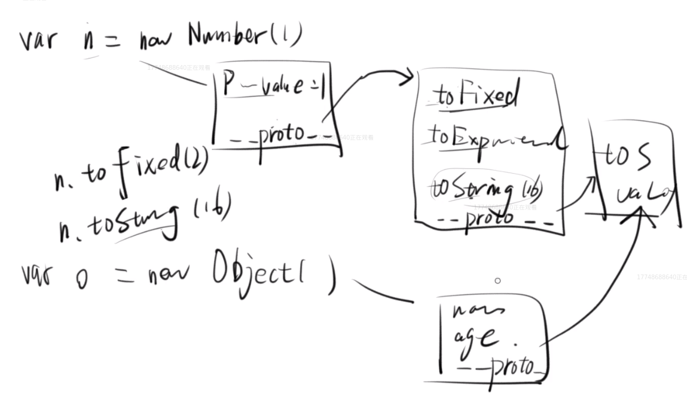
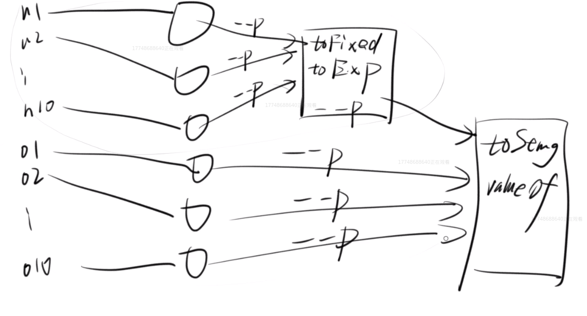
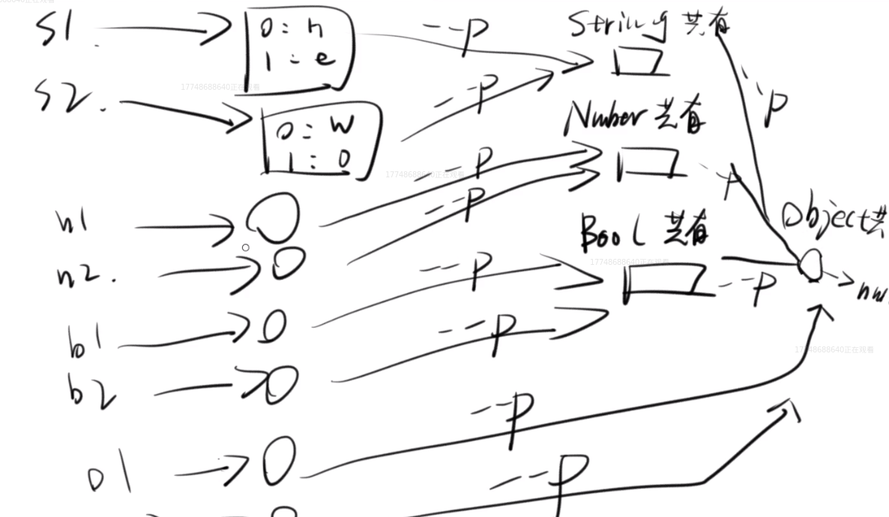
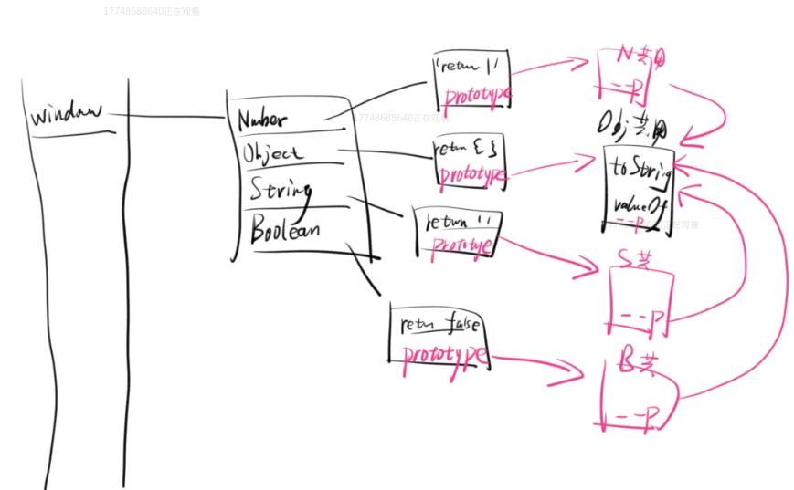
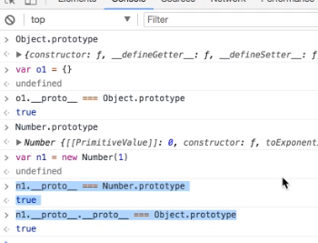
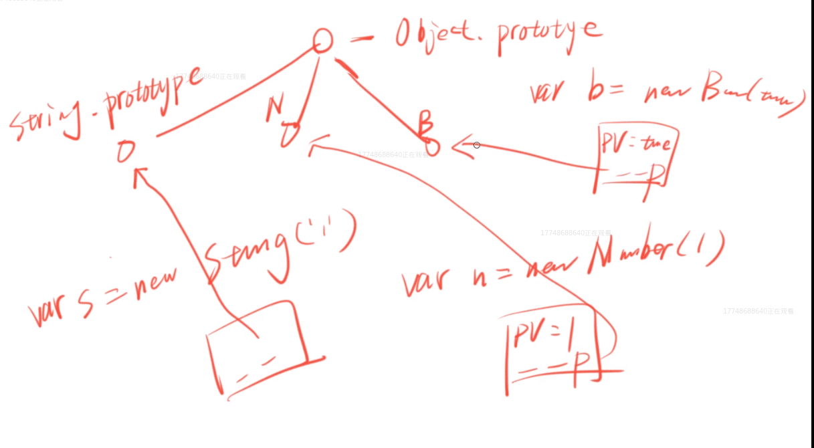
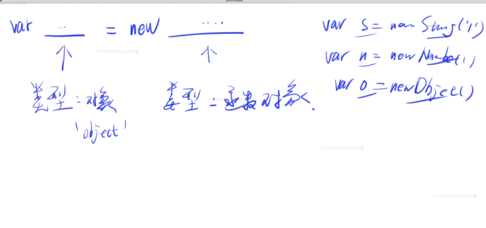
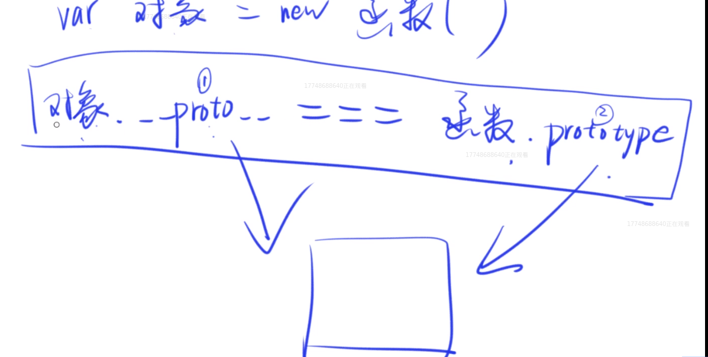


