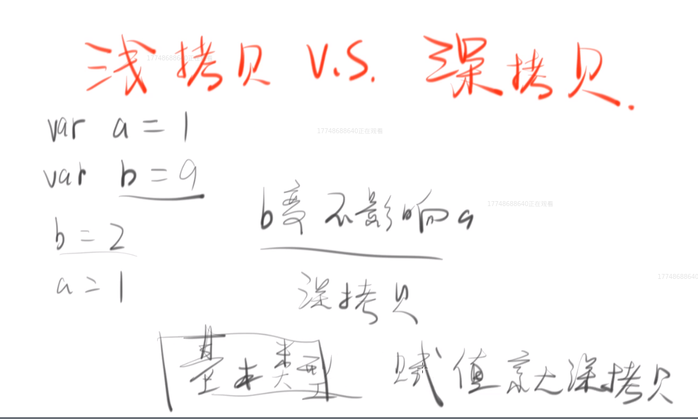

* JS中的数据类型总共7种，Number，String，Boolean，Symbol，Null，Undefined，Object。
> 其中前面6种为简单类型，后面1种为复杂类型。
>> 任何数据转换为Number有以下方式：
>>> 1.Number('1') //1 比较严格，纯数字才能转化，否则为NaN
>>> 2.ParseInt('1','10')  //1 
>>> 3.ParseInt('1.23)     //1.23
>>> 4.'1'-0  //1 减0
>>> 4.+'1'   //1 前面加号
>> 任何数据转换为String有以下方式:
>>> 1.toString() //null,undefined 会报错
>>> 2.数据+""   //与一个空字符串相加
>> 任何数据转换为boolean有以下方式:
>>> 1.Boolean()
>>> 2.!!  //双非
>> * 0,NaN,undefind,null,空字符串"" 转换为Boolean的时候为false，其他的都为true *
* 栈stack与堆heap
    简单类型存在栈内存中，复杂类型在堆内存中。

垃圾回收

内存泄漏解决（IE6）

深拷贝与浅拷贝

